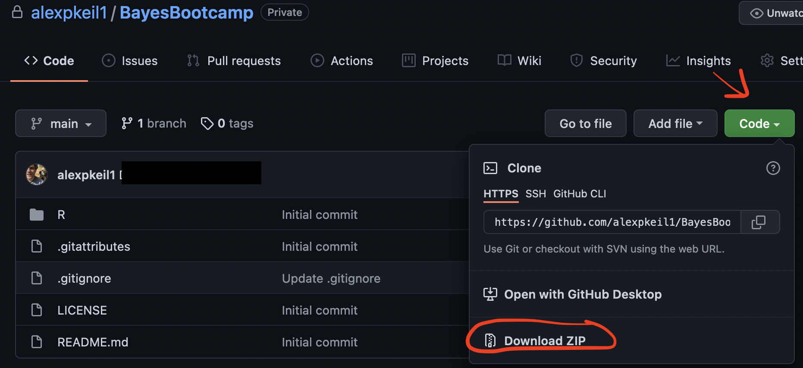

###BayesBootcamp
Programs and exercises to accompany the EPICOH 2021 workshop "The Brothers Bayes' Boisterous Bootcamp." Download the files contained in this repository by clicking on the green "Code" button and scroll down to "Download Zip." The code will be easiest to run if you unzip the downloaded file in the default "Downloads" folder of your computer. . 

The unzipped folder should include the following scripts in the "R" folder (R language):

- bayes\_shortcourse\_simdata.R: used by all other programs to simulate a simple dataset
- bayes\_shortcourse\_ex1\_indpriors.R: Bayesian linear regression with independent coefficient priors	
- bayes\_shortcourse\_ex2\_hierarchical.R: Bayesian linear regression with hierarchical “shared” coefficient priors	
- bayes\_shortcourse\_ex3\_mixture.R: Bayesian linear regression with coefficient mixture priors	
- bayes\_shortcourse\_ex4\_bma\_gcomp.R: Bayesian linear regression and g-computation with Bayesian model averaging/selection (BMA) priors

The rest of the exercises can be found in "exercises.docx"